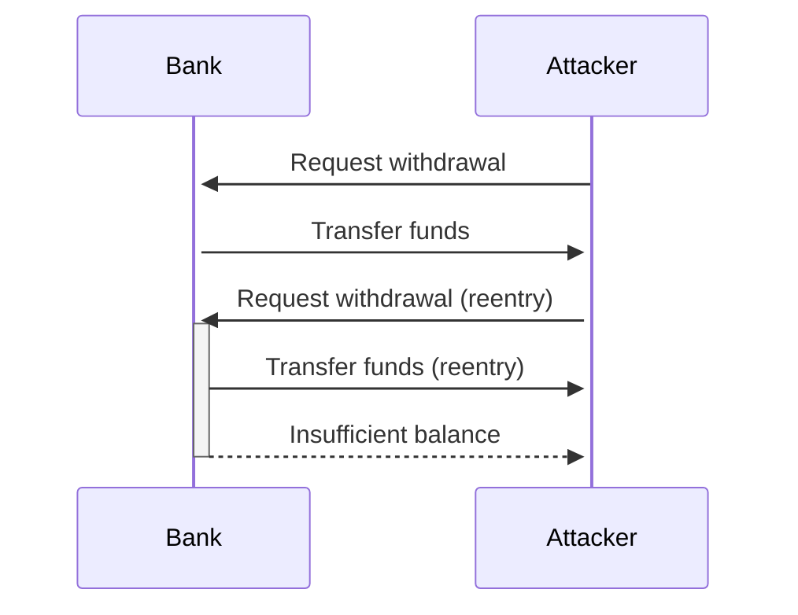

# 🔶 Diagrams & Formulas

Cantina Code supports **diagramming** libraries such as [Mermaid.js](https://mermaid.js.org/) and **MathJax for** mathematical formula rendering. Paired with a well written finding or comment, these tools allow you to visually and efficiently communicate your point to the reader.

## Mermaid Diagram

The following code block



when introduced as a comment will display as illustrated in the image below.

<figure><figcaption><p>Rendered mermaid diagram</p></figcaption></figure>

## MathJax Formulas

Cantina Comments also render MathJax formulas. The following code block

```
$$
H_{f} = \frac {\sum Collateral_{i}\;in\;ETH  \times  Liquidation\;Threshold}{Total\;Collateral\;in\;ETH} 
$$
```

when introduced inside a comment will render as such

<figure><figcaption><p>Rendered Mathjax formula</p></figcaption></figure>
